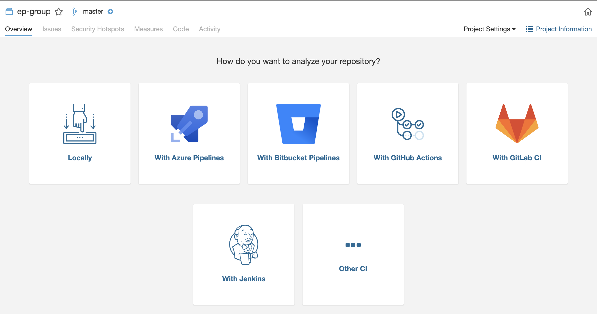

# sonarqube

SonarQube 是一个开源的代码分析平台, 用来持续分析和评测项目源代码的质量。 通过 SonarQube 我们可以检测出项目中重复代码， 潜在 bug， 代码规范，安全性漏洞等问题， 并通过 SonarQube web UI 展示出来。

SonarQube 支持包括 Java、Python、Php、C/C++、C#、HTML、JavaScript、PL/SQL、Objective C 等二十多种编程语言的代码质量管理与检测。可作为我们日常开发中检测代码质量的重要工具。

> 服务器部署 7 | g3 | QA-SJ-BJ01host | daily | 10.37.40.138 | www

## 安装 sonarqubue

1. [官网下载](https://www.sonarqube.org/downloads/) sonarqube,选择社区版本
2. sonarqube 需要 jdk11 版本支持 java8 会报错

## 一些问题

**内存不足**

提示内存不足不报错`Java HotSpot(TM) 64-Bit Server VM warning: INFO: os::commit_memory(0x00000000ea660000, 362414080, 0) failed; error='Not enough space' (errno=12)`

查看官方文档 https://docs.sonarqube.org/latest/instance-administration/monitoring/ 通过配置解决

找到 sonar.search.javaOpts 把 512m 更改为 128m

```bash
vim conf/sonar.properties

# JVM options of Elasticsearch process
sonar.search.javaOpts=-Xmx128m -Xms128m -XX:MaxDirectMemorySize=128m -XX:+HeapDumpOnOutOfMemoryError
```

**开放局域网访问**

```bash
# Binding IP address. For servers with more than one IP address, this property specifies which
# address will be used for listening on the specified ports.
# By default, ports will be used on all IP addresses associated with the server.
sonar.web.host=0.0.0.0
```


## 基本配置

实例启动并运行后，使用系统管理员凭据登录到 http://localhost:9000：

- 用户名 admin
- 密码 admin

第一次登陆需要更新密码 ,新密码为: `wd123456`

选择代码仓库


https://gitlab.vdian.net/profile/account 在 Private token 中查找
y4JGMFr4536wsJBZ_7Vz

选择手动


选择 local



## local scan


第一步 输入 token

sonarQube: 7194a7b40040e976c90fed0af16218891d7cc09c

创建或者使用一个 token `7194a7b40040e976c90fed0af16218891d7cc09c` 用于访问 sonarqube 服务

https://gitlab.vdian.net/profile/personal_access_tokens

按照提示输入要执行的内容

```bash
mvn sonar:sonar \
  -Dsonar.projectKey=ep-group \
  -Dsonar.host.url=http://10.37.40.138:9000 \
  -Dsonar.login=7194a7b40040e976c90fed0af16218891d7cc09c
```

执行完毕后,可以得到结果报表


## gitlab cli

GET http://example.com/api/v3/projects?private_token=QVy1PB7sTxfy4pqfZM1U

参考文档:

- [使用 gitlab API](https://www.jianshu.com/p/50d58fa8bdc6)
- [快速入门](https://docs.sonarqube.org/latest/setup/get-started-2-minutes/)


