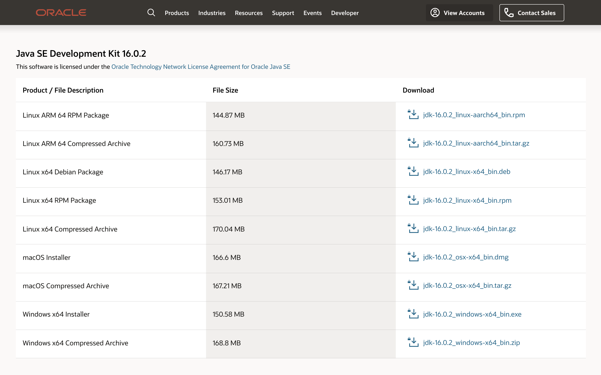
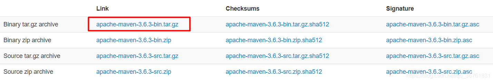

## MAC 安装 JAVA

## 版本号映射

Let's see how the major version numbers map to Java versions:

```
45 = Java 1.1
46 = Java 1.2
47 = Java 1.3
48 = Java 1.4
49 = Java 5
50 = Java 6
51 = Java 7
52 = Java 8
53 = Java 9
54 = Java 10
55 = Java 11
56 = Java 12
57 = Java 13


Oak	 	1995-05-23	Oak(橡树)
Java 1.0	JDK1.0	1996-01-23
Java 1.1	JDK1.1	1997-02-18
J2SE 1.2	JDK1.2	1998-12-04	Playground（运动场
J2SE 1.3	JDK1.3	2000-05-08	Kestrel（美洲红隼）
J2SE 1.4	JDK1.4	2002-02-13	Merlin（灰背隼）
Java SE 5.0	JDK1.5	2004-09-29	Tiger（老虎）
Java SE 6	JDK1.6	2006-12-11	Mustang（野马）
Java SE 7	JDK1.7	2011-07-28	Dolphin（海豚）
Java SE 8	JDK1.8	2014-03-18	Spider（蜘蛛）
Java SE 9	JDK1.9	2017-09-21
Java SE 10	JDK10	2018-03-21
Java SE 11	JDK11	2018-09-25
Java SE 12	JDK12	2019-3-20
```

## 下载与安装

1. 访问 [oracle 官网](https://www.oracle.com/downloads/) ,选择 java SE 进行下载

- https://www.oracle.com/java/technologies/javase-jdk16-downloads.html



**X86 和 ARM 的区别:**

- X86：复杂指令集;高性能方向;市场主要是 PC 和服务器
- ARM：精简指令集;低功耗方向;市场主要是手机和平板

**rpm 与 deb 的区别:**

- rpm 包主要用于 redhat 及分支如 redhat，centos，Fedora 等
- deb 包主要用于 debian 及分支如 debian，ubuntu 等

- username gaianote311@gmail.com
- password G\*\*0

2. 查看安装的版本

可以看到安装了两个版本

```bash
$ cd  /Library/Java/JavaVirtualMachines
$ ls

➜  JavaVirtualMachines ls
jdk-11.0.12.jdk  jdk1.8.0_231.jdk
```

```bash
$  vim  ~/.bashrc

# 设置 jdk 8
export JAVA_8_HOME=`/usr/libexec/java_home -v 1.8`
# 设置 jdk 11
export JAVA_11_HOME="$(/usr/libexec/java_home -v 11)"
# 默认JDK 8
export JAVA_HOME=$JAVA_8_HOME
#alias命令动态切换JDK版本
alias jdk7="export JAVA_HOME=$JAVA_7_HOME"
alias jdk8="export JAVA_HOME=$JAVA_8_HOME"
alias jdk11='export JAVA_HOME=$JAVA_11_HOME'


source ~/.bashrc
```

使用 jdk 命令切换版本

```bash
➜  JavaVirtualMachines jdk11
➜  JavaVirtualMachines java -version
java version "11.0.12" 2021-07-20 LTS
Java(TM) SE Runtime Environment 18.9 (build 11.0.12+8-LTS-237)
Java HotSpot(TM) 64-Bit Server VM 18.9 (build 11.0.12+8-LTS-237, mixed mode)
```

centos

增加软连接

```bash
# ln -s /usr/local/java/jdk1.8.0_171/bin/java /usr/bin/java
ln -s /usr/local/java/jdk-11.0.12/bin/java /usr/bin/java
```

在 bashrc 中

```bash
export JAVA_HOME=/usr/local/java/jdk-11.0.12
export JRE_HOME=${JAVA_HOME}/jre
export CLASSPATH=.:${JAVA_HOME}/lib:${JRE_HOME}/lib
export PATH=${JAVA_HOME}/bin:$PATH
```

- [搞懂 linux 环境变量](https://blog.csdn.net/u012052268/article/details/89554523)


## 安装mvn

https://maven.apache.org/download.cgi



在 bashrc 中


```bash
export MVN_HOME=/home/www/mvn/apache-maven-3.8.2
export PATH=${JAVA_HOME}/bin:$PATH:${MVN_HOME}/bin
```

替换配置文件


找到Maven文件夹下的conf文件夹（切换到conf文件目录下：cd conf），打开settings.xml配置文件,替换为[微店配置](http://docs.vdian.net/pages/viewpage.action?pageId=65093330)


https://dlcdn.apache.org/maven/maven-3/3.8.2/binaries/apache-maven-3.8.2-bin.tar.gz

https://blog.csdn.net/qq_36761831/article/details/105270617