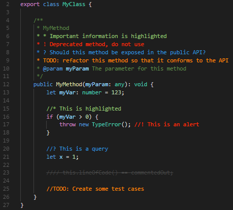

# code server

## 工作区

## 必备插件

* 中文语言设置 Chinese (Simplified) Language Pack for Visual Studio Code
* python https://dev.to/adamlombard/how-to-use-the-black-python-code-formatter-in-vscode-3lo0
* 缩紧 Python Indent 
* Git Graph

通过这个扩展，可以清楚地看见当前分支的 commit 记录和变化，可以通过按钮的方式轻易地创建、切换分支、cherry pick、merge 等操作。

* Better Comments 

1. 感叹号 “!” 代码警告。
2. 问号“?”代表存留疑问。
3. TODO 代码未来将要进行的操作。
4. @param 参数

