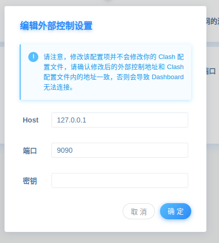
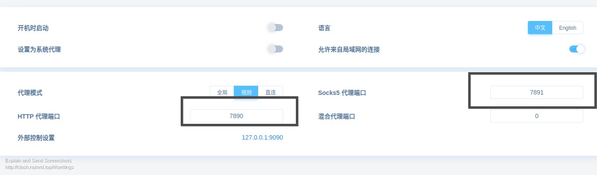
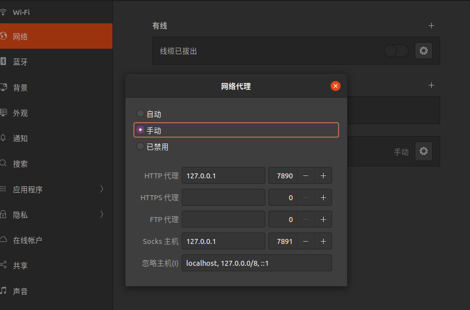

# 科学上网

## blinkload

- 机场网址 https://my.blinkload.org/user

## 软件

1. 下载 <a href="tools/_media/clashx.dmg" target="_blank">ClashX</a> 客户端，安装后运行。

## linux 使用 clash

> 参考资料: [ubuntu 20.04 配置使用 clash for linux](http://www.ptbird.cn/ubuntu-2004-clash-for-linux.html)

### 1. 下载并安装 clash for linux

1. 下载最新版本 clash：https://github.com/Dreamacro/clash/releases

对于 ubuntu,我们下载 clash-freebsd-amd64 即可 点击<a href="tools/_media/clash-freebsd-amd64-v1.6.5.gz" target="_blank">下载备份</a>

2. 解压到当前文件夹（当然你可以通过 ubuntu 软件提取）

```bash
gzip -f clash.gz -d
```

3. 授权可执行权限

```bash
chmod +x clash
```

4. 初始化执行 clash

```bash
./clash
```

初始化执行 clash 会默认在 `~/.config/clash/` 目录下生成配置文件和全球 IP 地址库：`config.yaml` 和 `Country.mmdb`

### 2. 配置 clash

clash 使用 yaml 作为配置文件，配置文件示例可以参考：https://github.com/Dreamacro/clash/wiki/configuration

默认的 clash 配置只有一个端口号，一般服务商会提供完整的配置文件（或者 URL），如果 URL 直接是配置内容，可以直接将配置文件内容复制到文件中

我的服务商提供的是无法直接应用的内容，因此还是从 windows 上的 clash 将配置内容导出来然后再复制到配置的。

再次执行 clash，可以发现执行成功（可以作为守护进程一直执行）

```
./clash
```

### 3. 使用 Web 工具管理 clash

地址：http://clash.razord.top/#/proxies

**配置控制台端口号**

Web 配置端口号 9090 可以从配置文件的 external-controller 找到



**配置 http 代理端口和 socket 代理端口**

一般情况下不需要修改，这两个端口在后续 network 代理配置中需要使用到



### 4. 配置 ubunutu 网络代理

打开 设置 -> 网络 -> 网络代理

配置 HTTP 代理和 socket 代理 分别为上面的端口号


