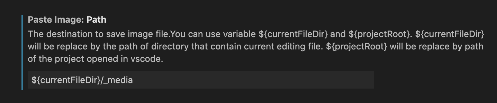
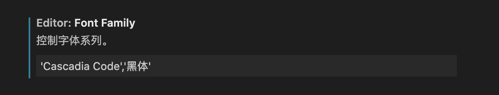

## workspace 工作区

[工作区](https://geek-docs.com/vscode/vscode-tutorials/vs-code-multi-root-workspace.html)

1. 打开文件夹,点击 菜单，文件 —> 将文件夹添加到工作区
2. 点击 菜单，文件 —> 将文件夹添加到工作区

### Paste Image

1. 插件商店搜索 `Paste Image` , 安装完成后重启 VS Code
2. 点击 Code — 首选项 — 设置 — 搜索 Paste Image
3. 修改 Paste Image: Path 可以设置图片的保存路径，我这里设置的是`${currentFileDir}/_media`，即在当前文档目录下再创建一个名为 `_media` 的文件夹，所有的截图存在这个 `_media` 文件夹下。如果 `_media` 文件夹不存在会自动创建



4. 使用 `command + option + v` 可以粘贴剪贴板中的图片到文件中,并且在 markdown 文档中生成以下内容：

```bash

```

## 常用插件

https://blog.csdn.net/iFasWind/article/details/109094274

- Settings Sync 配置同步
  Code Spell Checker
- Bracket Pair Colorizer 2 ： 括号对着色器 2，给代码中结对的括号（[]、{} 和 ()）上色，支持红黄蓝三种颜色。
- GitLens ：Git 透镜，这个扩展用于增强 VS Code 内置的 Git 功能，可以让你快速查看每一行代码的修改时间和编辑者，以及进行文件的版本对比。
- Cascadia Code 是微软一款开源字体，十分好看，mac 电脑可以直接寻找 ttf 文件进行安装；安装完毕后，在字体配置输入 'Cascadia Code','黑体'


