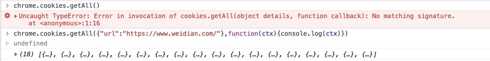

## cookie 管理

使用插件主要基于以下原因：

对于大部分的用户登陆信息（user token 等）来说，在保存到 cookie 中时，都带了 `HTTP_ONLY` 的 flag，这个 flag 作为一个安全机制，目前基本已经成为一个业内标准。即当 cookie 中的值被标记为 HTTP_ONLY 时，在 js 脚本中无法通过 `document.cookie` 获取。即，如果你希望在 js 中获取当前页面的 cookie 时，`document.cookie` 只能获取部分内容（非 HTTP_ONLY）。而 chrome plugin 因为有更高的操作权限，可以通过 `chrome.cookies` 接口获取所有的 cookie

因为我们期望的操作是获取用户登陆信息并同步到远端，数据安全尤为重要，以插件的方式进行操作，可以有效的隔离危险，防止被窥探

官方文档: [chrome.cookies](https://developer.chrome.com/docs/extensions/reference/cookies/)

我们可以在 backgroud 页直接调试 chrome API



### 使用要点

1. 需要在background页进行调用,content页没有充足的权限


2. 要使用 cookie API，您必须在清单中声明“cookies”权限，以及您要访问其 cookie 的任何主机的主机权限。例如：

```json
{
  "name": "My extension",
  ...
  "permissions": [
    "cookies",
    "*://*.google.com"
  ],
  ...
}
```


### API


Methods
get
get(details: CookieDetails): Promise<object>
get(details: CookieDetails, callback: function): void
getAll
getAll(details: object): Promise<object>
getAll(details: object, callback: function): void
getAllCookieStores
getAllCookieStores(): Promise<object>
getAllCookieStores(callback: function): void
remove
remove(details: CookieDetails): Promise<object>
remove(details: CookieDetails, callback?: function): void
set
set(details: object): Promise<object>
set(details: object, callback?: function): void

## 参考文档

- https://www.cnblogs.com/liuxianan/p/chrome-plugin-develop.html
- [用 chrome 插件实现 cookie 同步](https://blog.csdn.net/u013613428/article/details/93192961)
